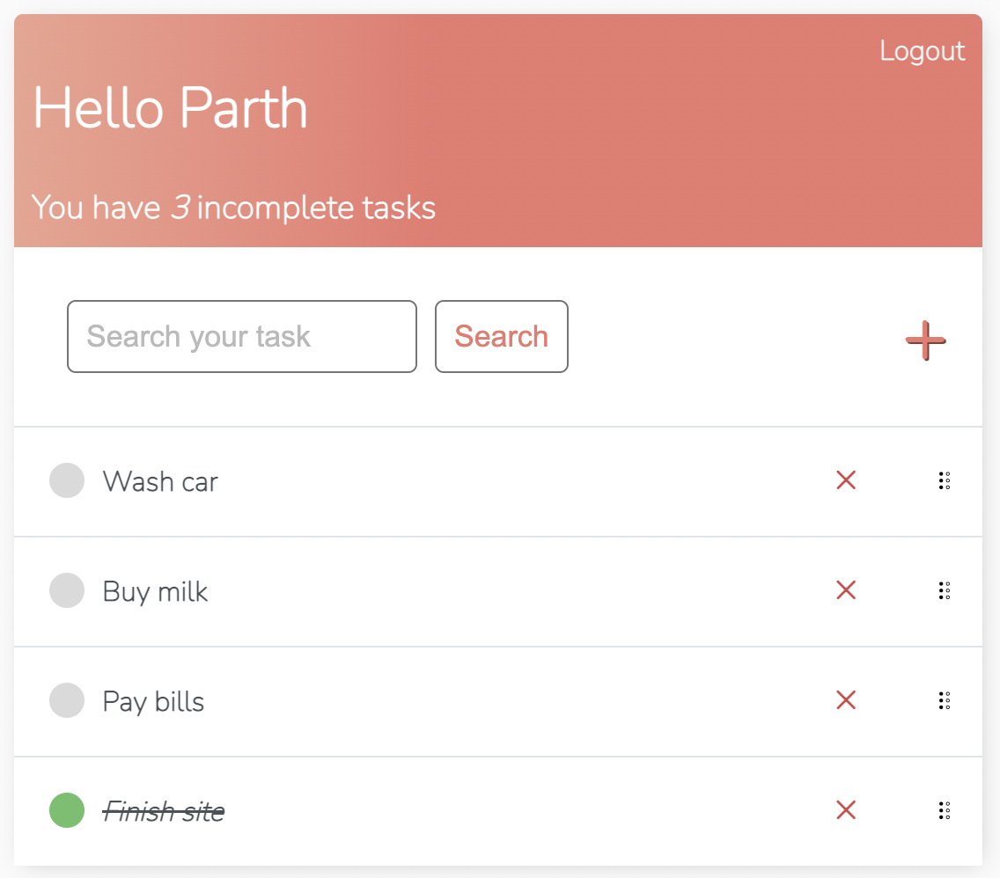
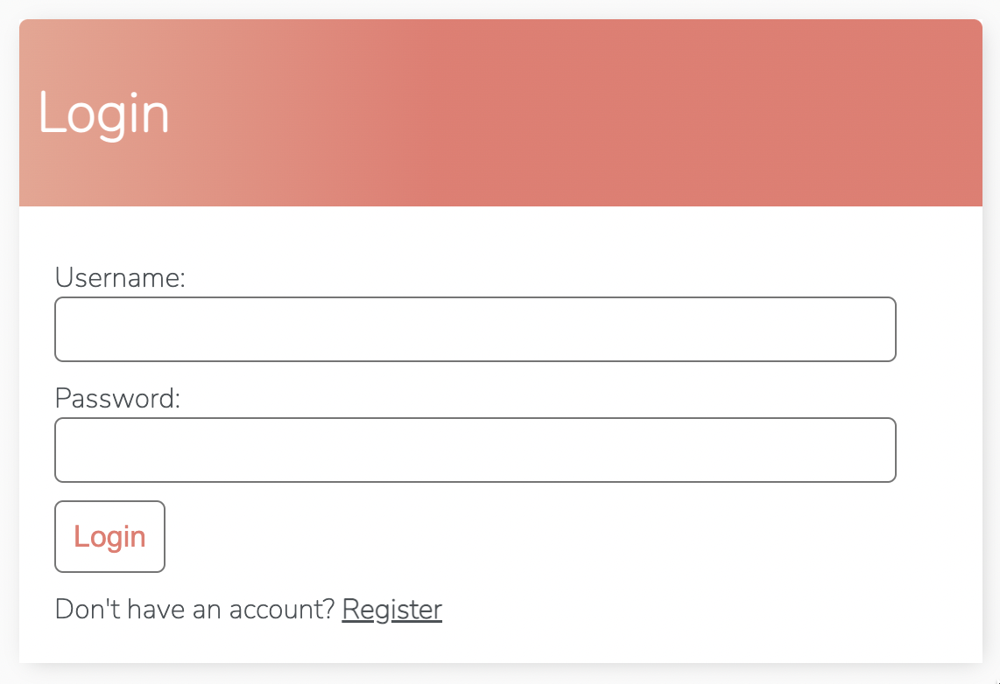

# Django ChatApp


Clean and simple to-do list application made with Django framework.

## Features

- Easy add, delete and edit tasks
- Reorder items
- Login and register
- Mark tasks as completed
- Clean UI





## Setup ##

1. Clone the project repository
```bash
git clone https://github.com/pycoder2000/djangochat.git
```

2. Move to the project root folder.
```bash
cd djangochat
```

3. Create and activate a virtual environment.
> (for mac)
```bash
virtualenv env
source env/bin/activate
```

To deactivate the environment
```bash
deactivate
```

4. Install requirements

```bash
pip3 install -r requirements.txt
```

5. Initialize database
```bash
python3 manage.py migrate
```

6. Create admin user
```bash
python3 manage.py createsuperuser
```

7. Run development server
```bash
python3 manage.py runserver
```

## Directory Layout

```bash
📦todo_list
 ┣ 📂base
 ┃ ┣ 📂templates
 ┃ ┃ ┗ 📂base
 ┃ ┃ ┃ ┣ 📜login.html
 ┃ ┃ ┃ ┣ 📜main.html
 ┃ ┃ ┃ ┣ 📜register.html
 ┃ ┃ ┃ ┣ 📜task_confirm_delete.html
 ┃ ┃ ┃ ┣ 📜task_detail.html
 ┃ ┃ ┃ ┣ 📜task_form.html
 ┃ ┃ ┃ ┗ 📜task_list.html
 ┃ ┣ 📜admin.py
 ┃ ┣ 📜apps.py
 ┃ ┣ 📜forms.py
 ┃ ┣ 📜models.py
 ┃ ┣ 📜tests.py
 ┃ ┣ 📜urls.py
 ┃ ┗ 📜views.py
 ┣ 📂todo_list
 ┃ ┣ 📜asgi.py
 ┃ ┣ 📜settings.py
 ┃ ┣ 📜urls.py
 ┃ ┗ 📜wsgi.py
 ┣ 📜db.sqlite3
 ┗ 📜manage.py
 ```
